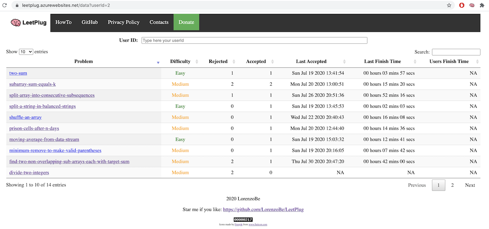
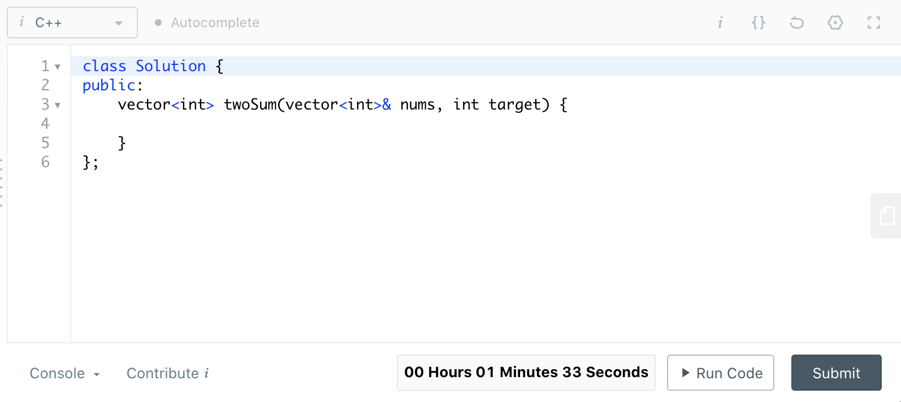

# LeetPlug
This is a browser extension that is able to interact with LeetCode official site.  
The main goal is to be able to track the activities on each problem and all the related events: submissions, time spent coding the solition, repetitions of a problem.  
The tracked activity is then uploaded on a [remote independent server](https://leetplug.azurewebsites.net/), where users are able to anonymously review their progresses and critical points playing with a table similar to this:
 

The project is composed of three layers:
- Client side: extension to be installed in the supported browsers
- Server side: data collection Web Service
- Server side: visualisation UI

## Browser extension
The browser extension is the main innovative idea here. Exactly like an AD Blocker extension, it's able to intercept the loading of the page and modify it on the fly to force a different behaviour. Specifically it must be able to:
- Identify when it is loading a LeetCode problem page
- Hide all the relevant information
- Present two buttons: one to start the coding with time tracking, another to start the coding without it (not everybody like to be tracked every time :D )
- When user clicks on "tracking" button:
  - A timer is started and the value is shown in the UI
  - The start event is sent to the remote LeetPlug server
  - All the Submit requests and the related results are intercepted and sent to the remote LeetPlug server
  - When the Submit result is successful the tracking is stopped
- When user clicks on "no tracking" button:
  - The problem is started without tracking any activity
The timer will appear embedded in the LeetCode page, in the lower-right corner:


Since I am a Chrome user, the preliminary version will support this browser. It should be easily ported to support Firefox also.  
The extension is currently published on the [Chrome Web Storage](https://chrome.google.com/webstore/search/leetplug), just search for LeetPlug.

### How to create an extension?
Coding a browser extension doesn't require any develpment tool or environment, I didn't imagine it was so easy!  
This is beacuse the extensions are based on HTML for the UI plus JavaScript for the logic, or at least the simple ones. A very nice tutorial that helped me to create my first extension in 10 minutes is [here](https://www.sitepoint.com/create-chrome-extension-10-minutes-flat/).  
Every extension has a manifest file, where you can specify which privileges you require and some nice triggering options that we'll use.

### How to intercept and modify the LeetCode page
I want to execute a script every time a user loads a LeetCode problem page. This can be easily done configuring the extension manifest with the following node:
```
"content_scripts": [
{
    "matches": ["https://leetcode.com/problems/*"],
    "run_at": "document_start",
    "js": ["thirdParty/jquery-3.5.1.slim.min.js", "src/problemsScript.js"]
}
]
```
The **content_scripts** are executed when the page matches the defined pattern. In "js" element defines the script to be executed as well as the JQuery library which I will use inside my logic.  
Since the LeetCode page are mostly dynamic, I was not able to easily refer to internal elements. I had to create in the [problemsScript.js](src/problemsScript.js) file a function which polls the page until all the needed elements are created. Then I use JQuery to change the attributes to the elements, to hide some of them and show my control buttons. I also followed the same approach to add the timer inside the page, near the bottom-right Submit button.  

### User registration and configuration
The user registration is done just with the email address. The user is asked to provide it, then a request is done to the Application Server which will generate an ID and a KEY to be used for connecting. It will be sent by email.  
The user must then insert the credentials in the proper fieldbox and store the configuration. But how to store it in a Chrome Extension? :D Luckily it seems to be very easy as per [this document](https://developer.chrome.com/extensions/storage).  
The extension has been written to use the local storage. The storage is not available from scripts which run inside the browser tab context. To pass the information to the content script I had to create a background script which can access to the storage and is able to receive and aswer to messages sent from the context script.

### How to intercept the Submit requests
To be able to track the user activity we need to intercept the Submit requests and the responses. The Chrome API allows to intercept the requests that are executed in the current tab (documentation is [here](https://developer.chrome.com/extensions/webRequest)). This would be the perfect solution, since the requests and the results can be clearly seen as JSON based messages using the Chrome debugger.  
Unfortunately the Chrome API can provide access to header and body of the outgoing messages but just to headers for incoming messages. This is done for performance reasons.  
Another option would be to use [Chrome Debugger API](https://developer.chrome.com/extensions/debugger), but this is available only if the debugger page is open.  
The only applicable solution was again to loop on the page and intercept when the submission result is added to the UI. This is a solution a little more complex but it works very well and JQuery helps a lot in this. 

## Application server
We need an application server and a database to track the single user activities. It could be done with a local database, but then we'll loose the possibility to work from multiple machines and also to compare our data with other users.  
Since I am not a big expert, I reused what I learned with my previous project [LeetcodeHistory](https://github.com/LorenzoBe/LeetcodeHistory). The main Web Service is written in Python and the events will be stored into a NOSQL database. I have a good knowledge now of Azure services so I used a Python WebApp connected to CosmosDB which has a nice [Python SDK](https://pypi.org/project/azure-cosmos/4.0.0/).  
Cosmos DB stores the data into documents, that can be easily transformed to JSON structures.  
I created two containers, defined as follow.

**users**  
This is an user entry:
```
{
    "id": "testuser@gmail.com",
    "email": "testuser@gmail.com",
    "userId": 1,
    "key": "9088fe6f-aeef-4f06-a527-e87a1befe2f9",
    "created": 1595099510,
    "lastEvent": 1595100733
}
```
The user contains the user id and the key, that will be used to configure the client side extension. It has two timestamos to track when the user was created and when it was used last time. The **lastEvent** timestamp can be ussed in the future to remove fake or unused accounts.

**problems**  
This is a problem entry:
```
{
    "id": "1:kids-with-the-greatest-number-of-candies",
    "userId": 1,
    "problem": "kids-with-the-greatest-number-of-candies",
    "difficulty": 1,
    "events": {
        "start": [
            {
                "id": "1595100711673",
                "time": 1595100724
            }
        ],
        "result_ok": [
            {
                "id": "1595100711673",
                "time": 1595100733
            }
        ]
    }
}
```
The problem contains the reference to the user and the problem. It stores all the events connected to them. For each problem attempted by the user it will store the events of start coding, submission accepted or submission refused. Every event has a unique id and a timestamp, so we can track how long it took to complete a problem, how many times was attempted and other useful metrics.  
Cosmos DB should be able to handle optimistic concurrency using the _etag value inside an item (see [here](https://docs.microsoft.com/en-us/azure/cosmos-db/database-transactions-optimistic-concurrency) for details) but unfortunately the Python library was bugged when I started the implementation. Please see below a fix for this.
<details>
<summary>How to fix Python azure-cosmos 4.0.0 ETAG bug</summary>
<p>
Unfortunately the version 4.0.0 of ezure-cosmos is bugged.  
The bug has been already solved and merged in the master [github](https://github.com/Azure/azure-sdk-for-python/pull/11792/commits/945648d26d2a077fa6544fe85648b58b5f9cedf9). The core change is in the "container.py" file:  


```python
result = self.client_connection.UpsertItem(
    database_or_container_link=self.container_link,
    document=body,
    options=request_options,
    **kwargs
)
```

</p>
</details>

### Storage estimation
Just as an exercise, we can try to calculate the webservice and database usage that could be the bottleneck of the entire system.  
According to the web, LeetCode has about 1 Million users. We can think to a 10% of active ones. Of these, probably just 1% will try to use my extension. Each user is very diligent and solve 5 problems each day.  
These numbers lead to the following outcomes:
* 1 Million users
* 100 K active users
* 1 K users adopt LeetPlug extension in the same period
* 5 K problems solved every day
* 5 K problems/day * 4 events each = 20 K events/day
* 20 K / 8 hours / 60 min / 60 sec = 0.7 events/second
* 5 K problems/day * 1000 bytes for each problem = 5 MB/day of database storage
* 5 MB/day * 365 = 1.9 GB/year

These numbers are not so scary, the designed isystem should be able to handle it. We will have 4 worker processes on the webservice and the Cosmo DB should be able to handle 400 request units per second (RU/s) throughput and 5 GBs storage per month for free (see [Azure documentation](https://azure.microsoft.com/en-us/pricing/details/cosmos-db/)).  
In case of big success it could be easily scaled up :D.

## Next steps
Collecting the user data could be just the starting point. It could be nice to have features like the following ones:
* Compare our best time solving a problem with the average time of other users
* Compare our problems history with the history of users which successfully cleared an interview, to be inspired on the problems to solve

## How to setup the environemnt to collaborate
1. The first step is probably to create it's own Cosmos DB instance. I created a template of what I am currently using, you can find it in [azure_cosmos_db_templates](webapp/azure_cosmos_db_templates). Don't ask me how to use it, I am learning like you :-) but I can give you some advices probably.
2. The WebApp can be configured and run locally. You need to fill the **config-sample.ini** file with the Azure Cosmos DB credentials and with a valid Gmail account (you can create a new one just for your tests, it is used to send the registration details). Then you need to rename the file to just **config.ini** and run the Flask environment as explained [here](https://docs.microsoft.com/en-us/azure/app-service/containers/quickstart-python?tabs=bash). Just as a shortcut, move to the webapp folder and run the following commands:
```
python3 -m venv venv
source venv/bin/activate
pip install -r requirements.txt
export FLASK_APP=application.py
flask run
```
3. The Chrome extension can be downloaded from the main Web Store or can be locally modified and loaded from the local folder [extension](extension).

## Thanks
As usual, I hope this project will be useful for others than me, helping and inspiring the continuos learning that we search to have a richer life! Enjoy! :D
